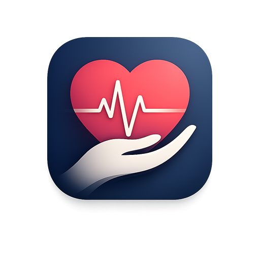
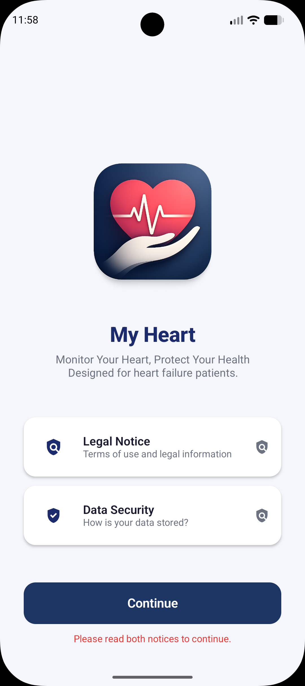
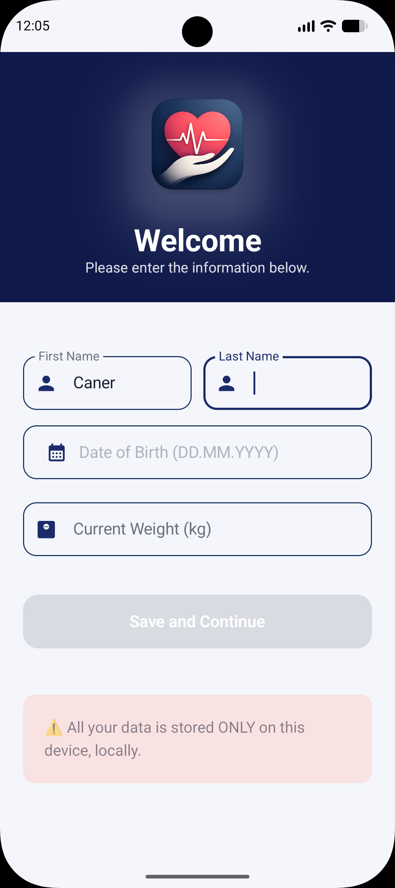
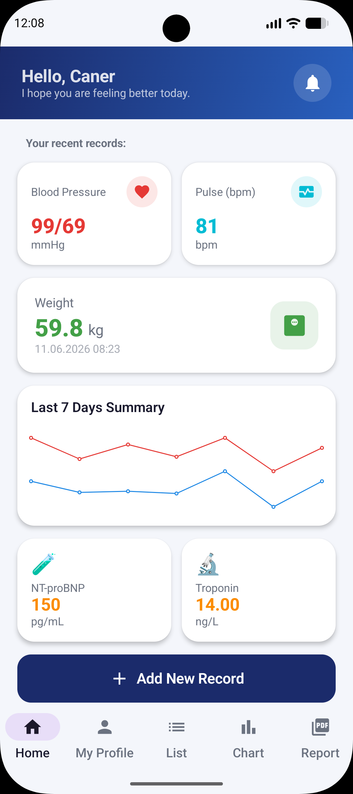
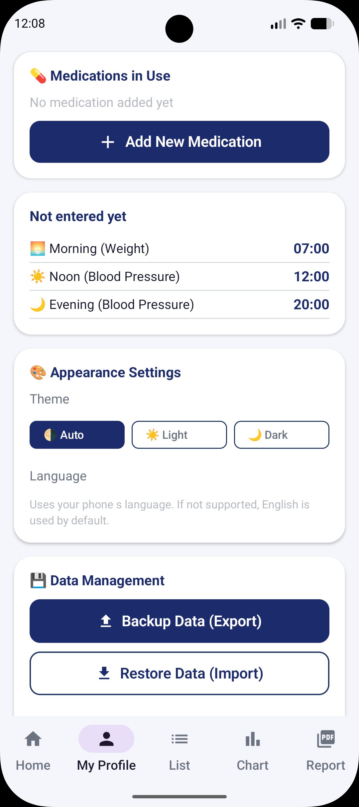
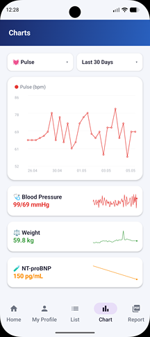
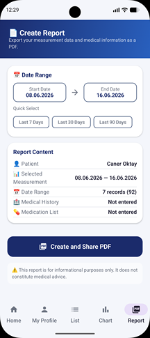

# Kalbim – Herzgesundheit-Tracker



**Kalbim** (türkisch für „Mein Herz") ist eine native Android-Anwendung für Patienten mit 
Herzinsuffizienz oder erhöhtem Herzrisiko. Die App ermöglicht die systematische Erfassung, 
Visualisierung und den Export von medizinischen Messwerten – vollständig offline und datenschutzkonform.

> ⚠️ **Wichtiger Hinweis:** Diese App dient ausschließlich zur persönlichen Aufzeichnung von 
> Gesundheitsdaten. Sie bietet **keine medizinische Beratung, Diagnose oder Behandlung**. 
> Bitte konsultieren Sie stets Ihren Arzt.

---

## 📱 Screenshots

      

      

---

## ✨ Funktionen

### 📊 Messwert-Erfassung
- **Blutdruck** (systolisch / diastolisch in mmHg)
- **Puls** (bpm)
- **Körpergewicht** (kg)
- **NT-proBNP / BNP** (pg/mL)
- **Troponin T/I** (ng/L)

### 📈 Visualisierung
- Interaktive Liniendiagramme für alle Messwerte
- Filterung nach Zeitraum (letzte 7 / 30 Tage oder benutzerdefiniert)
- Übersichtskarten mit aktuellen Werten auf dem Dashboard

### 📄 PDF-Berichte
- Professionelle Berichte mit Patientendaten, Krankengeschichte und Medikamentenliste
- Diagramme werden direkt in das PDF eingebettet
- Datumsbereichsfilter für gezielte Auswertungen
- Direkt teilbar (E-Mail, WhatsApp, Drucken etc.)

### 💊 Medikamentenverwaltung
- Erfassung von Medikamentenname, Dosierung und Einnahmezeiten
- Tagesdosis-Konfiguration (Morgens / Mittags / Abends / Nachts)
- Dosisänderungen mit Notizen protokollierbar
- Aktiv/Passiv-Status für abgesetzte Medikamente

### 🔔 Erinnerungssystem
- Tägliche Erinnerungen für Gewichtsmessung (Morgens)
- Erinnerungen für Blutdruckmessungen (Mittags / Abends)
- Individuelle Erinnerungszeiten pro Medikament und Einnahmezeitpunkt
- Funktioniert auch nach Geräteneustart (WorkManager)

### 💾 Datensicherung
- Export aller Daten als JSON-Datei
- Import / Wiederherstellung aus JSON-Backup
- Vollständig lokal – keine Cloud, kein Server

### 🎨 Benutzeroberfläche
- Modernes Material Design 3
- Dark Mode / Light Mode / Automatisch (Systemeinstellung)
- Mehrsprachig: 🇹🇷 Türkisch, 🇩🇪 Deutsch, 🇬🇧 Englisch
- Optimiert für ältere Nutzer (große Schrift, kontrastreiche Farben)

---

## 🔒 Datenschutz

- ✅ Alle Daten werden **ausschließlich lokal** auf dem Gerät gespeichert
- ✅ **Keine Internetverbindung** erforderlich
- ✅ Keine Datenübertragung an Server oder Dritte
- ✅ Keine Werbung, kein Tracking

---

## 🛠️ Technologie-Stack

| Bereich | Technologie |
|---|---|
| Programmiersprache | **Kotlin** |
| UI-Framework | **Jetpack Compose** (Material Design 3) |
| Lokale Datenbank | **Room Database** (SQLite) |
| Architektur | **MVVM** (ViewModel + Repository) |
| Hintergrundaufgaben | **WorkManager** (Benachrichtigungen) |
| PDF-Generierung | Android native `PdfDocument` |
| Diagramme | Canvas API (Jetpack Compose) |
| Datensicherung | JSON Export / Import |
| Min. Android-Version | **Android 8.0** (API 26) |

---

## 📐 Architektur

com.kalbim/

├── data/

│   ├── model/          ← Datenmodelle (UserProfile, Measurement, Medication)

│   ├── db/             ← Room Database & DAO

│   ├── repository/     ← Datenzugriffsschicht

│   └── backup/         ← JSON Export / Import

├── ui/

│   ├── screens/        ← Alle Bildschirme (Home, Liste, Grafik, Profil, Bericht)

│   ├── components/     ← Wiederverwendbare UI-Komponenten

│   └── theme/          ← Farben, Typografie, Theme

├── viewmodel/          ← Geschäftslogik (KalbimViewModel)

├── notification/       ← WorkManager, Benachrichtigungen, Sprachverwaltung

└── pdf/                ← PDF-Generator


---

## 🌍 Mehrsprachigkeit

Die App unterstützt folgende Sprachen:

| Sprache | Code | Datei |
|---|---|---|
| 🇹🇷 Türkisch | `tr` | `res/values/strings.xml` |
| 🇩🇪 Deutsch | `de` | `res/values-de/strings.xml` |
| 🇬🇧 Englisch | `en` | `res/values-en/strings.xml` |

Die Sprache wird automatisch anhand der Systemsprache gewählt.
Unterstützte Sprachen werden direkt übernommen, andernfalls wird Englisch verwendet.

---

## 📋 Backup-Format

Das JSON-Backup-Format für Import/Export:

```json
{
  "version": 1,
  "exportDate": "11.06.2026 23:01",
  "profile": {
    "firstName": "Max",
    "lastName": "Mustermann",
    "birthDate": "01.01.1955",
    "weightKg": 75.5
  },
  "measurements": [
    {
      "timestamp": 1748987472000,
      "dateLabel": "01.06.2026 08:10",
      "systolic": 89,
      "diastolic": 59,
      "pulse": 61,
      "weightKg": 61.6,
      "ntProBnp": null,
      "troponin": null,
      "notes": ""
    }
  ],
  "medications": [
    {
      "name": "Metformin",
      "dosage": "1000mg",
      "morning": 1,
      "noon": 0,
      "evening": 1,
      "night": 0,
      "isActive": true
    }
  ]
}
```

---

## 📄 Lizenz

Dieses Projekt steht unter der **MIT-Lizenz** – siehe [LICENSE](LICENSE) für Details.

---

## 👨‍💻 Entwickler

**Caner Oktay**  
Android-Entwicklung mit Kotlin & Jetpack Compose

---

*Entwickelt mit ❤️ für Herzpatienten und ihre Angehörigen*